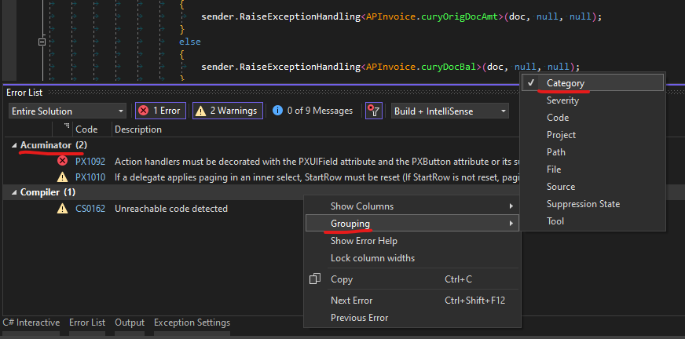
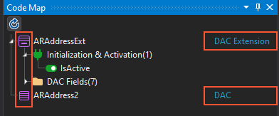
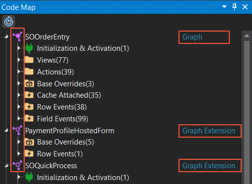
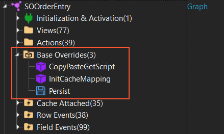
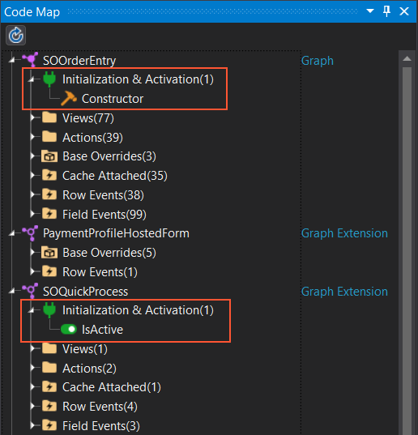
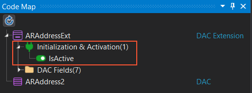
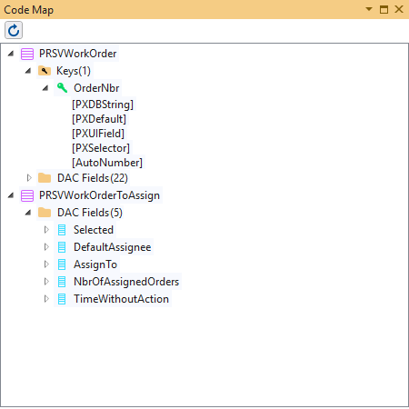

# Acuminator Release Notes
This document provides information about fixes, enhancements, and key features that are available in Acuminator.

## Acuminator 3.1.3: October 12, 2023
Acuminator 3.1.3 includes the bug fixes and enhancements described in this section, as well as the features that have been implemented in previous versions.

### Enhancements
In Acuminator 3.1.3, the following enhancements have been implemented:
 - The Acuminator code refactoring mechanism that changed weakly typed old graph event handlers into strongly typed generic event handlers has been converted into a new diagnostic [PX1041](diagnostics/PX1041.md).  
   The default severity of the new diagnostic is **Information** because Acumatica Framework supports both types of event handlers. Now you can use the new diagnostic to convert graph event handlers to generic ones in the entire document, project, and solution.
 - The category of Acuminator diagnostics has been changed to **"Acuminator"**. You can see this category in **Error List** window of Visual Studio if you group diagnostics by **Category** as shown in the following screenshot.<br/>
 <br/>
  
### Fixed Bugs
In this version of Acuminator, the following bugs have been fixed:
- Visual Studio 17.7 crashed when the static code analysis was configured to be executed in the Visual Studio process (*in process mode*). 
  The crashes were caused by the asynchonous code in old Acuminator analyzers. 


## Acuminator 3.1.2: June 8, 2023
Acuminator 3.1.2 includes the bug fixes and enhancements described in this section, as well as the features that have been implemented in previous versions.

### Enhancements
In Acuminator 3.1.2, the following enhancements have been implemented:
 - The [PX1096](diagnostics/PX1096.md) diagnostic has been added to check the signature of methods with the `PXOverride` attribute: The diagnostic checks whether the base graph or base graph extensions contain a base method that is compatible with the `PXOverride` method. 
 - The [PX1007](diagnostics/PX1007.md) diagnostic has been updated in the following ways:
   - The diagnostic now supports the `inheritdoc` tag for DACs, DAC extensions, and their properties. The diagnostic also checks that mapped DAC field properties of projection DACs have the `inheritdoc` tag with the `cref` attribute pointing to the corresponding DAC field property of the original DAC. 
   - A new code fix can generate the `inheritdoc` tag for a mapped DAC property of a projection DAC.
     This code fix also removes incorrect documentation tags such as `summary` or incorrectly declared `inheritdoc`.
   - Code fixes of the diagnostic can now generate documentation correctly even for badly formatted code. Also, in the properties of mapped fields of projection DACs, incorrect documentation tags can be removed. The code fixes also support documentation tags declared as empty XML elements, such as `<summary/>`.
   - The diagnostic no longer checks the following DAC fields for a code annotation:
     - `Selected`
     - `Attributes`
     - `GroupMask`
     - `CompanyID`
     - `CompanyMask`
     - `DeletedDatabaseRecord`
   - The **Suppress with a local comment** code fix of Acuminator now supports the **Fix All** functionality of Visual Studio for the [PX1007](diagnostics/PX1007.md) diagnostic. The diagnostic can be suppressed for a whole DAC. Suppressing the diagnostic could be useful when you do not plan to write the documentation immediately and want to leave it to the documentation team.
 
### Fixed Bugs
In this version of Acuminator, the following bugs have been fixed:
 - In Visual Studio 2022, Acuminator analysis did not work in the out-of-process mode (that is, when the **Run code analysis in separate process** check box is selected in Visual Studio options). 
 - The [PX1023](diagnostics/PX1023.md) diagnostic showed a false alert for the `INUnit` attribute.
 - It was possible to suppress the [PX1007](diagnostics/PX1007.md) diagnostic for DAC extensions by marking the class with the `PXHidden` attribute.
 - The [PX1016](diagnostics/PX1016.md) diagnostic showed a false alert for generic non-abstract graph extensions.

### Acknowledgements
The Acuminator team would like to thank our open source contributor [Kemal Taskin](@taskinkemal). We are grateful for your input and hope you stay with us.


## Acuminator 3.1.1
Acuminator 3.1.1 includes the bug fixes and enhancements described in this section, as well as the features that have been implemented in previous versions.

### Enhancements
In Acuminator 3.1.1, the following enhancements have been implemented:
- The [PX1042](diagnostics/PX1042.md) diagnostic has been changed to reflect the changes in Acumatica Platform. Starting with Acumatica ERP 2023 R1, Acumatica runtime has been changed to allow execution of database queries in the `RowSelecting` event handler without a separate connection scope. Therefore, in Acumatica ERP 2023 R1 and later versions, this diagnostic is disabled.
- Localization diagnostics [PX1050](diagnostics/PX1050.md), [PX1051](diagnostics/PX1051.md), and [PX1053](diagnostics/PX1053.md) have been enhanced to support the `PX.Objects.Common.Exceptions.PXExceptionInfo` class. This class represents a data transfer object frequently used in Acumatica code to store data about exceptions. Localization diagnostics will treat this data the same way they treat Acumatica Framework exceptions derived from `PXException` as follows:
   - Check that hard-coded strings are not passed as arguments to the `PXExceptionInfo` constructor calls. Only localizable string constants can be passed to the `PXExceptionInfo` constructor.
   - Do not report error when the `PXExceptionInfo.MessageFormat` property is passed to APIs checked by Acuminator localization diagnostics, such as `PXException` constructor calls.
- The [PX1016](diagnostics/PX1016.md) diagnostic has been changed to not check for the `IsActive` method in graph extensions that include the override of the `Configure` method with the screen configuration and workflows. Information about the `Configure` method has been added to the graph semantic model.
- The [PX1018](diagnostics/PX1018.md) diagnostic has been updated to not show a warning about abstract graphs and generic graphs that have a generic type parameter as their primary DAC.

#### Analysis of Data Type Attributes and DAC Field DB Boundness Calculation
The Acuminator analysis of Acumatica data type attributes has been significantly reworked:
- Calculation of relationships between Acumatica attributes has been improved.
- The unbound [PXVariantAttribute](https://help.acumatica.com/(W(98))/Help?ScreenId=ShowWiki&pageid=92f5623d-eebb-e5e7-db17-5aa98633b219) is now supported.

The heuristic calculation of DAC field's relationship with a database (which we call _DB boundness_) has been significantly improved:
- The set of possible DB boundness values has been extended. Previously, Acuminator could calculate only four types of DAC field's DB boundness: _NotDefined_, _Unbound_, _DbBound_, and _Unknown_.<br/> 
	Now Acuminator displays three more values: 
	- _PXDBScalar_
	- _PXDBCalced_
	- _Error_ (for the case when Acuminator can prove that the data type attributes on a DAC field property are declared incorrectly)
	These new values are displayed in the Code Map for DACs and DAC extensions. The _Error_ value is displayed in the Code Map as __"Inconsistent"__.
- Support for Acumatica aggregator attributes in the DB boundness calculation has been improved.<br/> 
Aggregator attributes are attributes derived from the [PXAggregateAttribute](https://help.acumatica.com/(W(98))/Help?ScreenId=ShowWiki&pageid=9c64f185-b2a4-14ee-eef1-d78c0e05d100) class. They can combine functionality from several attributes:
  ```C#
  [PXDBInt]
  [PXUIField(DisplayName = "Customer")]
  [PXDefault]
  [PXSelector(typeof(Search<BAccountR.bAccountID,
              Where<BAccountR.status, Equal<BAccount.status.active>>>))]
  public class CustomerActiveAttribute : PXAggregateAttribute { }
          
  public class ARInvoice : IBqlTable
  {
    [CustomerActive]
    public override Int32? CustomerID { get; set; }
  }
  ``` 
- Calculation of DB boundness has been improved to support hybrid data type attributes with mixed DB boundnesses. Such attributes can be placed on both bound and unbound DAC field properties. They usually have the `IsDBField` (or `NonDB` in case of `PXDBLocalizableStringAttribute`) flag which configures the attribute's DB boundness. The flag may have a default value, also it could be explicitly set on the attribute's declaration on a DAC field property or an aggregator attribute. Acumatica code includes a number of such attributes: `PeriodIDAttribute`, `PXEntityAttribute`, and attributes derived from them. They are supported in the new release.
- The DB boundness calculation now supports combinations of hybrid and aggregator attributes and combines the default DB boundness with the DB boundness explicitly set on attribute's application on a DAC field property or an aggregator attribute.
- The calculated attribute's DB boundness and information about the attribute's data type is now cached in the DAC semantic model and shared between Acuminator DAC analyzers.

The changes in the attribute analysis provided an ability to make significant improvements in the following diagnostics:
- The [PX1095](diagnostics/PX1095.md) diagnostic now supports both `PXDBCalcedAttribute` and `PXDBScalarAttribute` attributes. Any of them, when used on a DAC field property, requires an unbound data type attribute like `PXStringAttribute` placed on the same DAC field property. Previously, the PX1095 diagnostic checked only `PXDBCalcedAttribute` but starting from this release both attributes are checked.
- The precision and performance of the following diagnostics has been improved:
  - [PX1019](diagnostics/PX1019.md)
  - [PX1020](diagnostics/PX1020.md)
  - [PX1021](diagnostics/PX1021.md)
  - [PX1023](diagnostics/PX1023.md)
  - [PX1030](diagnostics/PX1030.md)
  - [PX1095](diagnostics/PX1095.md)
  
### Fixed Bugs
In this version of Acuminator, the following bugs have been fixed:
- The published version 3.1 of the `Acuminator.Analyzers` nuget package was corrupted and did not work. The nuget package is fixed in this release.
- Graph Semantic Model incorrectly collected actions, action delegates, views, and view delegates for non-generic graph extensions derived from other graph extensions. This led to different possible bugs in static code analysis of graphs and graph extensions. The Code Map also displayed incorrect data. 
- The [PX1091](diagnostics/PX1091.md) diagnostic did not report error in a scenarios involving a graph action with an action delegate and a class hierarchy of graph extensions. In particular, the error was not reported in a scenario with a `Base` and `Derived` graph extensions when the action delegate was re-declared in `Base` and overridden in `Derived`, and the override calls the base action delegate from the graph via extension's `Base` property.  
- The false alert in the [PX1091](diagnostics/PX1091.md) diagnostic for a call to the base action delegate method via `base` keyword in the action delegate method C# override.
- The incorrect resolution of C# property and method overrides which resulted in the incorrect collection of data for the graph extension's `Initialize` method in case of several method overrides.
- Minor bugfixes in code analysis and performance optimizations.

### Other Changes
Stability of the Acuminator tests infrastructure has been improved in the following ways:
  - Validation of the test initial state has been added
  - Error processing for failed tests has been enhanced
 

## Acuminator 3.1
Acuminator 3.1 includes the bug fixes and enhancements described in this section, as well as the features that have been implemented in previous versions.

### Enhancements
In Acuminator 3.1, the following enhancements have been implemented:
 - The [PX1062](diagnostics/PX1062.md) diagnostic has been added to make sure that graphs and graph extensions do not contain static actions, views, or other static mutable fields and properties.
 - The following new diagnostics have been added to prevent errors related to the serialization and deserialization of exceptions: 
   - The [PX1063](diagnostics/PX1063.md) diagnostic ensures that the exception classes derived from `System.Exception` always declare a serialization constructor.
   - The [PX1064](diagnostics/PX1064.md) diagnostic ensures that the exception classes derived from `System.Exception` which declare new serializable data, always provide an override of the `GetObjectData` method.
 - Support for the following complex expressions passed to SetProcessDelegate API has been added to the [PX1008](diagnostics/PX1008.md) and [PX1086](diagnostics/PX1086.md) diagnostics:
   - A cast expression as shown in the following example:
     ```C#
	 ProcessProductSync.SetProcessDelegate((PXProcessingBase<KNCASyncDetails>.ProcessListDelegate)delegate
	 {
	    ProductCreateUpdate();
	 });
	 ```
   - An object creation expression as shown in the following example:
     ```C#
	 ProcessProductSync.SetProcessDelegate(new PXProcessingBase<KNCASyncDetails>.ProcessListDelegate(delegate
	 {
		ProductCreateUpdate();
	 }));
	 ```
   - A local variable or parameter that stores the delegate
   - A property or field that stores the delegate
 - The [PX1056](diagnostics/PX1056.md) diagnostic has been added to check whether a graph is created in the `IsActive` or `IsActiveForGraph` method in a graph extension or a DAC extension, and warn you if it is.
 - The [PX1057](diagnostics/PX1057.md) and [PX1084](diagnostics/PX1084.md) diagnostics now prevent graph creation via a direct constructor call&mdash;that is, the `new PXGraph()` method call.
 - The [PX1050](diagnostics/PX1050.md) and [PX1051](diagnostics/PX1051.md) diagnostics now display fewer false alerts and find more cases of incorrect localization, such as interpolation strings.
 
 #### Code Snippets
 Acuminator now provides code snippets for DACs, DAC fields, and graph events. A developer can use these code snippets to speed up the writing of new code and avoid common mistakes.
 You can start using code snippets by typing "dac" or "_" and selecting the appropriate snippet in the IntelliSense code completion list, as shown in the following screenshot.
 <br/>
   <br/>
 When you select a shortcut from the IntelliSense suggestions and press Tab, the system inserts the code snippet, as shown in the following screenshot.
 <br/> 
   <br/>
   For more details on installing and using the code snippets, see [the CodeSnippets repository on GitHub](https://github.com/Acumatica/CodeSnippets). 
   
 #### Improvements in the PX1008 Diagnostic 
 The [PX1008](diagnostics/PX1008.md) diagnostic has been completely reworked. Now this diagnostic implements a data flow analysis that goes recursively into methods and checks how the data is transferred to them.
 The following enhancements have been implemented in the diagnostic:
   - Checks to be sure that when adapters of the `PXAdapter` type are passed to an action delegate in a graph or a graph extension, the adapters are not captured in delegate closures by long-running and processing delegates.
   - Improvements in diagnostic messages
   - Checks that custom views and attributes capture graph and adapter references in a closure of a long run delegate
   - Bug fixes: The diagnostic displayed a warning when capturing a reference to `this` in a delegate even in a class that was not a graph or a graph extension
 
 #### Improvements in the PX1072 Diagnostic 
 The following fixes have been implemented in the [PX1072](diagnostics/PX1072.md) diagnostic:
   - In static graph members, the declaring graph is no longer considered available for usage in BQL or Fluent BQL queries.
   - The diagnostic no longer displays a warning if a single local graph is available and used in a BQL or Fluent BQL query.
   - The diagnostic now displays a warning when a class contains multiple BQL or Fluent BQL queries and there are no available graphs&mdash;that is, graphs instances that already exist and can be used by a BQL query.
 
### Fixed Bugs
In this version of Acuminator, the following bugs have been fixed:
 - Two Acuminator code fixes, which suppressed Acuminator diagnostic alerts either with a local comment or in the Acuminator suppression file, stopped appearing in the UI in the latest release of Visual Studio 2022.
 - When a diagnostic was suppressed in a global suppression file via a code fix for a project without the Acuminator suppression file, Acuminator incorrectly generated it in Visual Studio 2022. It did not generate the "AdditionalFiles" section in the project file for the generated suppression file.
 - The [PX1086](diagnostics/PX1086.md) diagnostic failed on syntax expressions that create collections with the collection initializer when the constructor braces were omitted.
 - The process of creating a graph semantic model has been improved. Now runtime errors that occurred in diagnostics of graphs and graph extensions have been fixed.
 - The performance of the [PX1073](diagnostics/PX1073.md) and [PX1074](diagnostics/PX1074.md) diagnostics has been improved. Runtime errors during the analysis of a graph extension were fixed in these diagnostics through the removal of the redundant analysis of events from the base graph.
 - Minor bugs with inter-procedural analysis of local functions have been fixed.
 - Acuminator failed during the analysis of code with a graph that is a generic type parameter that is passed to the `PXGraph.InstanceCreated.AddHandler`  method.

### Other Changes
 - Extended design of syntax walkers for inter-procedural analysis has been implemented. Also, extension points and a new API have been added.
 - Nullable reference code analysis and nullable annotations have been introduced to parts of Acuminator. 
 - The design of syntax walkers has been extended for inter-procedural analysis.


## Acuminator 3.0
Acuminator 3.0 includes the bug fixes and enhancements described in this section, as well as the features that have been implemented in previous versions.

### Enhancements
In Acuminator 3.0, the following enhancements have been implemented:
 - Acuminator now supports Visual Studio 2022 in addition to the two previous versions of Visual Studio, 2017 and 2019. Also, Acuminator now supports preview versions of Visual Studio. 
 - The [PX1007](diagnostics/PX1007.md) diagnostic now checks only DACs, DAC extensions, and public field properties for these classes.
 - The [PX1008](diagnostics/PX1008.md) diagnostic now validates delegates passed to the `PXLongOperation.StartOperation()` method. You can now find captured references to the graph instance in delegate closures.
 - The [PX1026](diagnostics/PX1026.md) diagnostic now allows underscores in the names of DAC extensions. 
 
 #### Improvements in the Code Map
 The Code Map has been improved in the following ways:
 - Different icons are now displayed for DACs, DAC extensions, graphs, and graph extensions. 
   See the following screenshots for examples of these icons.<br/>
   <br/>
   
 - Each DAC node now indicates whether the node represents a DAC or a DAC extension as shown in the previous screenshot.
 - For each graph or a graph extension, overrides of virtual type members are now displayed under the new **Base Overrides** node. The `Persist` method overrides are indicated with a special diskette icon. 
   See the following screenshots for an example of this node.<br/>
   
 - The **Initialization and Activation** node has been introduced. It displays the following information:
	- Graph instance and static constructors for graphs and graph extensions
	- The `IsActive` method for a graph extension and a DAC extension 
   See the following screenshots for examples of the **Initialization and Activation** node.<br/>
   <br/>
   
 - The Code Map window is automatically reopened at Visual Studio startup if the Code Map was opened at the last Visual Studio closure.
 
### Fixed Bugs
In this version of Acuminator, the following bugs have been fixed:
 - Acuminator refactorings did not work when Visual Studio was configured to perform static code analysis in a separate process.
 - The [PX1073](diagnostics/PX1073.md) diagnostic now does not show an error for the exception thrown in the `RowPersisted` event handler of a graph if at least one of the following conditions is met:
      - The graph declaring the `RowPersisted` event handler is a processing graph. For processing graphs all exception types are allowed.
      - The graph declaring the `RowPersisted` event handler is a non-processing graph and the type of the exception is among one of the following exception types or is derived from them:
         - `PX.Data.PXRowPersistedException`
         - `PX.Data.PXLockViolationException`
         - .NET exceptions from the System namespace: `NotImplementedException`, `NotSupportedException`, `ArgumentException` (including its descendants `ArgumentNullException` and `ArgumentOutOfRangeException`)
 
 #### Disabling of Locally Suppressed Diagnostics
 Acuminator provides two different suppression mechanisms to suppress diagnostic alerts in a particular place: a global suppression file and a local suppression with a special comment. The suppression mechanism can be disabled in the Acuminator settings in Visual Studio by specifying False for the following setting: **Tools > Options > Acuminator > Code Analysis > Suppress selected diagnostics**. With this mechanism disabled, you can see all suppressed errors in the legacy code and perform refactoring.
 Previously, you could disable suppression of only globally suppressed diagnostic alerts. Alerts that have been suppressed locally via suppression comments could not be displayed even when the suppression mechanism was turned off. Now Acuminator diagnostics that have been suppressed locally can also be displayed when suppression is disabled. Thus, you can see all errors, including the ones that were suppressed with a comment in the code editor or in the **Error List** tool window. 
 For details on diagnostic suppression, see [Diagnostic Suppression](diagnostics/DiagnosticSuppression.md).
 
### Other Changes 
 - The [PX1088](diagnostics/PX1088.md) diagnostic has been removed because its function is covered by the [PX1008](diagnostics/PX1008.md) diagnostic.
 
### Gratitudes 
The Acuminator team would like to thank our open source contributors: @ShadowFiendZX and @shawnburt. We are grateful for your input and hope you stay with us.

## Acuminator 2.3.2
Acuminator 2.3.2 includes the bug fixes and enhancements described in this section, as well as the features that have been implemented in previous versions.

### Enhancements
In Acuminator 2.3.2, the following enhancements have been implemented:
 - The [PX1076](diagnostics/PX1076.md) diagnostic has been added to check for and warn a developer that their code uses Acumatica APIs marked with the PXInternalUseOnly attribute.
 - The documentation for the [PX1046](diagnostics/PX1046.md) diagnostic was extended, the reasoning for the diagnostic is now provided.
 
### Fixed Bugs
In this version of Acuminator, the following bugs have been fixed:
 - Due to the changes in Visual Studio 2019 (version 16.8.0), Acuminator custom settings were not enabled, and the Acuminator analyzers used default values. Acuminator custom code analysis settings specified by the user did not work with a new 64-bit out of process static code analysis introduced by Visual Studio 2019. When the out of process feature was enabled, only default settings were used.
 - In the [PX1036](diagnostics/PX1036.md) diagnostic, foreign keys for different DACs that use the same set of DAC fields were incorrectly considered as duplicates.
 - Due to the changes in Visual Studio 2019 (version 16.8.2), switching between themes was impossible. 
 - Stability of Acuminator syntax highlighting has been improved.


## Acuminator 2.3.1
Acuminator 2.3.1 includes the bug fixes and enhancements described in this section, as well as the features that have been implemented in previous versions.

### Enhancements
In Acuminator 2.3.1, the following enhancements have been implemented:
 - The [PX1037](diagnostics/PX1037.md) diagnostic has been added to verify that a primary, unique, or foreign key declaration does not include an unbound DAC field.
 - The [PX1036](diagnostics/PX1036.md) diagnostic has been updated to check the correct naming of foreign key declarations.
 - The [PX1035](diagnostics/PX1035.md) diagnostic has been changed to check for duplicates with the same sets of fields among unique and foreign keys.
 
### Fixed Bugs
In this version of Acuminator, the following bugs have been fixed:
 - The Code Map displayed incorrect information about whether a DAC field is bound to database table column or not.
 - The setting of the `IsDBField` parameter in the `Account` and `Sub` attributes and their inheritors was ignored by Acuminator analysis.
 - The calculation of an attribute's bound type was performed incorrectly and did not account for the following factors:
   - Whether the IsDBField property was declared in the attribute's base type
   - What the value of the `NonDB` property of the PXDBLocalizableString attribute was
   - Whether the IsDBField property of the attribute was derived from a standard field type attribute such as PXDBString, PXString, or PXDBCalced.
 - When checking for an unbound attribute used along with `PXDBCalced`, the [PX1095](diagnostics/PX1095.md) diagnostic did not correctly use the attribute's bound type.


## Acuminator 2.3
Acuminator 2.3 includes the bug fixes and enhancements described in this section, as well as the features that have been implemented in previous versions.

### Enhancements
In Acuminator 2.3, the following enhancements have been implemented:
 - The [PX1036](diagnostics/PX1036.md) diagnostic has been added to verify the correct naming of key field declarations in the PK API.
 - The [PX1035](diagnostics/PX1035.md) diagnostic has been added to check for and warn the developer of multiple primary key declarations.
 - The [PX1033](diagnostics/PX1033.md) and [PX1034](diagnostics/PX1034.md) diagnostics have been added to suggest adding a PK or FK definition to a DAC.
 - The [PX1016](diagnostics/PX1016.md) diagnostic has been added to check whether a graph or DAC extension has the `IsActive` method implemented.
 - The Code Map has been improved as follows:
   - The Code Map now indicates whether each graph is for mass processing operations and whether each graph node corresponds to a graph or a graph extension.
   - The Code Map now indicates whether each DAC field is auto-incremented (has the `AutoNumberAttribute` attribute).
   - The Code Map performance was greatly optimized. The time for the construction of the Code Map decreased from 3-5 minutes to 1-2 seconds on code files with ~12 000 lines of code
 - The Code Map now displays complementary information about graph views. A developer can see indicators for the following:
   - Views for mass processing operations
   - Setup views
   - Filter views
   - Custom views derived from the base `PXSelect` types
   - Views derived from `PXSelectReadOnly` types   


### Fixed Bugs
In this version of Acuminator, the following bugs have been fixed:
 - The [PX1015](diagnostics/PX1015.md) diagnostic did not support counting of fluent BQL-like query parameters.
 - The Code Map window frequently became out of sync with active document for various reasons.
 - The error suppression code action was incorrectly displayed when multiple diagnostics reported error on the same syntax node.

## Acuminator 2.2
Acuminator 2.2 includes the bug fixes and enhancements described in this section, as well as the features that have been implemented in previous versions.

### Enhancements
In Acuminator 2.2, the following enhancements have been implemented:
 - The [PX1019](diagnostics/PX1019.md) diagnostic has been added to check for DAC fields of a non-string type with the `AutoNumberAttribute` attribute.
 - The [PX1020](diagnostics/PX1020.md) diagnostic has been added to check if the length of a string DAC field with the `AutoNumberAttribute` attribute is sufficient.
 - The [PX1022](diagnostics/PX1022.md) diagnostic has been added to check if a DAC extension or a graph extension is declared as a public class.
 - It is now possible to sort the code map. The context menu of the Acuminator Code Map now includes an active sort indicator and the following new commands: 
   - Sort node's children by declaration order or by name
   - Sort all node descendants by declaration order or by name
   <p>Also, the context menu has been redesigned to better integrate with the Visual Studio style.</p>
 - The following complementary information about DAC fields is displayed in the Code Map in a separate column: the field type, an indicator of whether the field is an identity field, and an indicator of whether the field is bound or unbound.


### Fixed Bugs
In this version of Acuminator, the following bugs have been fixed:
 - Acuminator failed on Microsoft Visual Studio 2017.
 - The suppression file and Acuminator settings sometimes were loaded incorrectly due to package being loaded by Visual Studio at a random time.

## Acuminator 2.1.3
Acuminator 2.1.3 includes the bug fixes and enhancements described in this section, as well as the features that have been implemented in previous versions.

### Enhancements
In Acuminator 2.1.3, the following enhancements have been implemented:
 - Acuminator now does not perform static analysis of projects whose names contain `Test` or `Benchmark`. Generally, these projects contain tests of an application and do not include any application logic; therefore there is no need to analyze them with Acuminator.
 - The memory usage, performance, and stability of the code map have been improved.
 - The synchronization of the code map with the changes in the DACs has been improved.
 - Now a developer can collapse or expand the selected node (with all its descendant nodes) in the code map if the developer clicks **Collapse All** or **Expand All** (respectively) in the context menu for the selected node.
 - Multiple changes have been made to the [PX1007](diagnostics/PX1007.md) diagnostic to reduce the number of warnings displayed by the diagnostic. For more information about the situations when the diagnostic is not displayed, see the description of the diagnostic in [PX1007](diagnostics/PX1007.md).
 - If a developer suppresses the [PX1007](diagnostics/PX1007.md) diagnostic with a comment, the default comment message is now the following: _Acuminator disable once PX1007 NoXmlCommentForPublicEntityOrDacProperty to be documented later_.
 - The performance of the [PX1021](diagnostics/PX1021.md), [PX1023](diagnostics/PX1023.md), and [PX1095](diagnostics/PX1095.md) diagnostics has been improved.

### Fixed Bugs
In this version of Acuminator, the following bugs have been fixed:
 - The [PX1007](diagnostics/PX1007.md) diagnostic was displayed for partial classes with XML comments on one of the declarations.
 - The [PX1094](diagnostics/PX1094.md) diagnostic was displayed for classes derived from `PXMappedCacheExtension`.
 - Acuminator failed on the Acuminator suppression file if the file had an incorrect XML structure. Now Acumatinator validates the XML structure of the suppression file.
 - The Acuminator suppression file was not loaded correctly because Visual Studio prematurely loaded the Acuminator VSIX package.
 - The issues that were caused by the concurrent access of different analyzers to the same Acuminator suppression file have been fixed.

## Acuminator 2.1.2
Acuminator 2.1.2 includes the bug fixes described in this section, as well as the features that have been implemented in previous versions.

### Fixed Bugs
In this version of Acuminator, the following bugs have been fixed:
- Suppression of diagnostics in the Acuminator suppression file was not supported for interfaces, structs, enumerations, and delegates.
- The [PX1005](diagnostics/PX1005.md) diagnostic could be incorrectly displayed for data view delegates that have corresponding data views.
- The [PX1032](diagnostics/PX1032.md) diagnostic was incorrectly displayed for extension method calls in DACs.

## Acuminator 2.1.1
Acuminator 2.1.1 includes the bug fixes described in this section, as well as the features that have been implemented in previous versions.

### Fixed Bugs
In this version of Acuminator, the following bugs have been fixed:
- The diagnostics related to localization failed with the `OperationCanceledException` exception when concurrent execution is turned on.
- Acuminator installed from the NuGet package generated warnings about `Microsoft.CodeAnalysis.Workspaces`.

## Acuminator 2.1
Acuminator 2.1 includes the diagnostics, code fixes, enhancements, and bug fixes described in this section, as well as the features that have been implemented in previous versions.

### New Diagnostic and Code Fixes
In this version, the diagnostic and code fixes have been added for the following issue.

| Code                            | Issue Description                                                | Type    | Diagnostics | Code Fix    | 
| ------------------------------- | ---------------------------------------------------------------- | ------- | ----------- | ----------- |
| [PX1007](diagnostics/PX1007.md) | A public entity or DAC property should have a description in the `summary` XML tag. | Warning (ISV Level 3: Informational)	 | Available | Available   |

The new diagnostic is available only if the value of **Tools > Options > Acuminator > Code Analysis > Enable PX1007 diagnostic** is set to _True_. By default, the value of this option is _False_.

### Ability to Suppress a Diagnostic by Adding a Code Comment
In Acuminator 2.1, you can suppress any diagnostic by adding a specific comment directly in code. To add a suppression comment, you select **Suppress the PXYYYY diagnostic with Acuminator > in a comment** (where PXYYYY is the code of the diagnostic) as a code fix for the diagnostic, as shown in the following screenshot.


The code below shows an example of a suppression comment that has been added by the code fix. A suppression comment includes the following parts:

 - The code of the diagnostic (`PX1007` in the code example below).
 - The name of the diagnostic (`NoXmlCommentForPublicClass` in the following code example), which can give a code reviewer an idea of what the suppressed diagnostic is about.
 - The justification of the suppression, which explains why this diagnostic is suppressed for this code fragment. You type the explanation instead of `[Justification]`.

```C#
// Acuminator disable once PX1007 NoXmlCommentForPublicClass [Justification]
public abstract class PXBaseRedirectException : PXException
{
    ...
}
```

You can also suppress an Acuminator diagnostic in the Acuminator suppression file. This option is now available as a code fix and has been removed from the menu commands. The suppression of a diagnostic in the Acuminator suppression file is available only if Acuminator is installed from the VSIX package.

For details about the diagnostic suppression, see [Diagnostic Suppression](diagnostics/DiagnosticSuppression.md).

### Enhancements and Bug Fixes in the Code Map
In Acuminator 2.1, the code map is no longer an experimental feature and includes the following enhancements:

 - The code map now can be used for DACs and DAC extensions. For each DAC, the list of key fields and the full list of DAC fields is displayed. For each DAC field, the code map shows the list of attributes. The code map for a file that contains two DACs is shown in the following screenshot.

 

 - The code map now supports cycling navigation between partial definitions of graphs.
 - The code map UI has been updated with the new icon set.

 The following bugs have been fixed:

 - The code map could freeze for a graph that included a method with a signature similar to that of an event handler.
 - The code map could not display generic event handlers if they had custom names.
 - The code map did not support `CacheAttached` generic event handlers.

### Other Enhancements and Fixed Bugs
In this version of Acuminator, the following enhancements and bug fixes are available:

 - All diagnostics related to DACs now work faster because these diagnostics share the collected semantic information.
 - The [PX1002](diagnostics/PX1002.md) diagnostic now supports DAC extensions. 
 - Null reference issues have been fixed in the BQL formatter and the diagnostics related to fluent BQL.
 - The [PX1004](diagnostics/PX1004.md) and [PX1006](diagnostics/PX1006.md) diagnostics were incorrectly displayed for code based on Acumatica Framework 2018 R2 or later.
 - The [PX1029](diagnostics/PX1029.md) diagnostic was incorrectly displayed for DAC extensions that extended the DACs declared as nested types inside graphs.
 - The [PX1024](diagnostics/PX1024.md) diagnostic did not work for `new` abstract class fields of derived DACs.
 - The [PX1030](diagnostics/PX1030.md) diagnostic was incorrectly displayed for the DACs that contain only unbound fields.
 - The [PX1055](diagnostics/PX1055.md) diagnostic worked incorrectly if the key fields were defined both in the base DAC and in the derived DAC.
 - The BQL outlining worked incorrectly for unary BQL functions, such as `RTrim`.
 - The suppression mechanism did not reload the suppression file when you change the solution in Visual Studio.
 - In some cases, it was not possible to suppress an Acuminator diagnostic in the Acuminator suppression file for a code fragment. The following error was displayed: _There are no Acuminator diagnostics in this code snippet_.
 - The new suppression file was added to the project with the _None_ build action (instead of the _AdditionalFiles_ build action).
 - There was inconsistency in code of the suppression manager related to the use of the project name and the assembly name.

## Acuminator 2.0
Acuminator 2.0 includes the bug fixes and enhancements described in this section, as well as the features that have been implemented in previous versions.

### Key Changes
Acuminator 2.0 includes the following key changes:

 - Acuminator no longer supports Visual Studio 2015. With drop of support of Visual Studio 2015, Acuminator has been moved to Roslyn 2.0 and new Visual Studio SDK methods. These changes improve UX and UI response time and the Acuminator load time.
 - Acuminator now supports C# 7.3.

### Enhancements to Suppression Mechanism
With the new version of Acuminator, you can suppress a particular diagnostic in a specific place in your project as follows:

 1. Click the code that is highlighted by the Acuminator diagnostic so that the editor cursor is in the highlighted element.
 2. Click **Suppress Acuminator Diagnostic > in Acuminator Suppression File** in the context menu or on the **Acuminator** main menu of Visual Studio.

The suppressed diagnostic is saved in the Acuminator suppression file, which is located in the folder of your Visual Studio project. This file has the same name as the project file and the `acuminator` extension. If there is no Acuminator suppression file in the project folder, the file is created automatically.

Acuminator suppression mechanism differs from the standard suppression mechanism of Visual Studio. With the Acuminator suppression mechanism, you can suppress a particular diagnostic in a specific place in the project, while the standard mechanism suppresses all diagnostics with this ID in the type or its member.

To stop suppression of the diagnostic in the particular place in the code, you remove the diagnostic from the Acuminator suppression file manually.

### Fixed Bugs
In this version of Acuminator, the following bugs have been fixed:

 - If the Acuminator suppression file had an incorrect XML format, syntax highlighting and other functions stopped working.
 - The [PX1015](diagnostics/PX1015.md) diagnostic was displayed for `PXSelectExtension.Select` methods. Now the diagnostic is not performed on these methods.
 - The [PX1048](diagnostics/PX1048.md) diagnostic was displayed if the code contained the `is` pattern. In Acuminator 2.0, the version of Roslyn that is used internally has been updated to 2.0, which supports the `is` pattern.
 - The analyzer for the [PX1030](diagnostics/PX1030.md) diagnostic failed with an error on some solutions.

### Other Enhancements
Acuminator 2.0 also includes the following enhancements:

 - The code map stays open when the Visual Studio solution is closed.
 - If the value of **Tools > Options > Acuminator > Code Analysis > Enable additional diagnostics for ISV Solution Certification** is _False_, the following diagnostics can now display warnings instead of errors: [PX1027](diagnostics/PX1027.md), [PX1043](diagnostics/PX1043.md), [PX1045](diagnostics/PX1045.md), [PX1047](diagnostics/PX1047.md), [PX1057](diagnostics/PX1057.md), [PX1071](diagnostics/PX1071.md), [PX1073](diagnostics/PX1073.md), and [PX1075](diagnostics/PX1075.md).

## Acuminator 1.6.2
Acuminator 1.6.2 includes the bug fixes described in this section, as well as the features that have been implemented in previous versions.

### Fixed Bugs
In this version of Acuminator, the following bugs have been fixed:

 - The PX1005 diagnostic (for typos in the names of view delegates) displayed warnings for action handlers.
 - Acuminator diagnostics incorrectly worked for `PeriodIDAttribute` and descending classes (such as `FinPeriodAttribute`) and `AcctSubAttribute` and descending classes.
 - Acuminator NuGet package generated warnings about Acumatica-related dependencies.
 - In the code map, the graph events were collected incorrectly: The generic and non-generic events were not grouped together; the hierarchy of graph extensions was created incorrectly.
 - In some cases, because Roslyn had incorrectly determined the effective set of interfaces for the generic type parameter, the code map did not display generic events.

## Acuminator 1.6.1
Acuminator 1.6.1 includes the diagnostics, code fixes, and enhancements described in this section, as well as the features that have been implemented in previous versions.

### New Diagnostics and Code Fixes
In this version, the diagnostic and a code fix have been added for the following issue.

| Code                            | Issue Description                                                                                           | Type    | Diagnostics | Code Fix    | 
| ------------------------------- | ----------------------------------------------------------------------------------------------------------- | ------- | ----------- | ----------- |
| [PX1013](diagnostics/PX1013.md) | The action handler that initiates a background operation or is executed by a background operation must return `IEnumerable`. | Error | Available   | Available   |

### Enhancements and Bug Fixes in the Code Map
Acuminator 1.6.1 includes the following enhancements in the code map:

 - In the text editor of Visual Studio, the symbol to which the code map navigates is now highlighted.
 - The tooltip for a data view in the code map now keeps the BQL formatting of the source code.
 - The namespace prefixes have been removed from the tooltips in the code map.
 - The categories without child nodes are no longer displayed in the code map.
 - The code map now displays the methods of the base graph that have been overridden through the `PXOverride` attribute.
 - The performance of the code map has been improved.

 The following bugs have been fixed:

 - The code map didn't support graphs with complex declarations.
 - The code map could crash due to an unhandled exception from Roslyn.
 - The code map performed calculations in hidden mode.

### Code Analysis Enhancements
Acuminator now includes the following new options:

 - An option to turn off Acuminator static analysis. If you set the value of **Tools > Options > Acuminator > Code Analysis > Enable code analysis** to _False_, Acuminator diagnostics are not displayed.
 - An option to turn off the suppression mechanism for the Acuminator diagnostics. If you set the value of **Tools > Options > Acuminator > Code Analysis > Suppress selected diagnostics** to _False_, Acuminator ignores the suppression file and displays all diagnostics it has found. This option is intended for internal use in Acumatica.

### Other Fixed Bugs
In this version of Acuminator, the following bugs have been fixed:

 - The PX1018 error was displayed for data views defined in the fluent BQL style.
 - Fluent BQL joins were not supported by the Acuminator colorizer.
 - Acuminator didn't recognize graphs if they were used as generic type parameters. <br/>**Fix description**: Graphs as generic type parameters are now supported. Multiple diagnostics (such as PX1000, PX1001, PX1003, and PX1005) have been refactored. 

### Other Enhancements
Acuminator 1.6.1 also includes the following enhancements:

 - Acuminator now supports Visual Studio 2019. 
 - The PX1005 diagnostic now supports graph extensions.

## Acuminator 1.6
Acuminator 1.6 includes the diagnostics, code fixes, and enhancements described in this section, as well as the features that have been implemented in previous versions.

### New Diagnostics and Code Fixes
In this version, diagnostics and code fixes for the following issues have been added.

| Code                            | Issue Description                                                                                           | Type    | Diagnostics | Code Fix    | 
| ------------------------------- | ----------------------------------------------------------------------------------------------------------- | ------- | ----------- | ----------- |
| [PX1060](diagnostics/PX1060.md) | DAC fields should be strongly typed to be used in fluent BQL queries.                                       | Message | Available   | Available   |
| [PX1061](diagnostics/PX1061.md) | Constants should be strongly typed to be used in fluent BQL queries.                                        | Message | Available   | Available   |
| [PX1090](diagnostics/PX1090.md) | `PXSetupNotEnteredException` cannot be thrown in action handlers.                                           | Warning | Available   | Unavailable |
| [PX1091](diagnostics/PX1091.md) | This invocation of the base action handler can cause a `StackOverflowException`.                            | Warning | Available   | Unavailable |
| [PX1092](diagnostics/PX1092.md) | Action handlers must be decorated with the `PXUIField` attribute and with the `PXButton` attribute or its successors. | Error | Available   | Available |
| [PX1093](diagnostics/PX1093.md) | In a graph declaration, the first type parameter of `PXGraph` must be the graph type.                       | Error   | Available   | Available   |
| [PX1094](diagnostics/PX1094.md) | Every DAC should be decorated with the `PXHidden` or `PXCacheName` attribute.                               | Warning | Available   | Available   |
| [PX1095](diagnostics/PX1095.md) | A field with the `PXDBCalced` attribute must have an unbound type attribute, such as `PXDate` or `PXDecimal`. | Error   | Available   | Unavailable |

### Code Map
In this version, you can view the structure of a graph and navigate between the graph members by using the code map. The code map, which is shown in the following screenshot, displays the tree of data views and their delegates, actions and action handlers, and row and field events. Row events are grouped by the DACs to which they are related, and field events are grouped by the DACs and DAC fields. 


By clicking the nodes of the tree, you can navigate between the members in the code of the graph. You can also double-click the **Views** or **Actions** node, or a node for a DAC in event nodes to navigate between the graph members of this node. You can use the code map for navigation in code during debugging.

The tooltips for the nodes display the following information:

 - For the data view and action nodes, the full declarations of the data views and actions
 - For the field nodes in the **Cache Attached** node, the attributes declared on the `CacheAttached` events
 - For the attribute nodes in the **Cache Attached** node, the full declaration of each attribute

If you switch between the files, the code map is updated automatically. You can also refresh the code map by clicking the **Refresh Code Map** button on the toolbar of the dialog box.

The code map is an experimental feature, with improvements planned in the coming versions. To open the code map for a graph, click **Code Map (Experimental)** on the **Acuminator** main menu of Visual Studio.

### Fixed Bugs
In this version of Acuminator, the following bugs have been fixed:

 - The PX1030 diagnostic worked incorrectly with customizations of `PXDefault` on original DAC fields. Now the diagnostic can display either an error or a warning. For details, see the description of the diagnostic in [PX1030](diagnostics/PX1030.md).
 - Graph-related diagnostics could fail with the _Value cannot be null_ error in some solutions.
 - The recursive diagnostics could enter an endless loop in some solutions.
 - The use of `PXView.Select` in `FieldSelecting` caused the PX1045 error.
 - The PX1088 warning could be displayed for non-processing graphs.

### Other Enhancements
Acuminator 1.6 also includes the following minor enhancements:

 - By invoking the **Go To Action/View Declaration/Handler** action in the context menu or on the **Acuminator** main menu, you can now navigate in code during debugging.
 - The [PX1004](diagnostics/PX1004.md) and [PX1006](diagnostics/PX1006.md) diagnostics have been reimplemented. The diagnostics now support graphs and graph extensions. The diagnostics work with the code based on Acumatica Framework 2018 R1 or earlier.
 - More details have been added to the description of the [PX1014](diagnostics/PX1014.md) diagnostic.

## Acuminator 1.5
Acuminator 1.5 includes the diagnostics, code fixes, and enhancements described in this section, as well as the features that have been implemented in previous versions.

### New Diagnostics and Code Fixes
In this version, diagnostics and code fixes for the following issues have been added.

| Code                            | Issue Description                                                                                        | Type    | Diagnostics | Code Fix    | 
| ------------------------------- | -------------------------------------------------------------------------------------------------------- | ------- | ----------- | ----------- |
| [PX1047](diagnostics/PX1047.md) | In the `FieldDefaulting`, `FieldVerifying`, and `RowSelected` event handlers, DAC instances passed to these event handlers cannot be modified. | Error   | Available   | Unavailable |
| [PX1048](diagnostics/PX1048.md) | For the `RowInserting` and `RowSelecting` events, only the DAC instance that is passed in the event arguments can be modified in the event handler. | Error   | Available   | Unavailable |
| [PX1049](diagnostics/PX1049.md) | In `RowSelected` event handlers, BQL statements and other database queries should be avoided.            | Warning | Available   | Unavailable |
| [PX1055](diagnostics/PX1055.md) | An invalid primary key of the DAC is used.                                                               | Error   | Available   | Available   |
| [PX1059](diagnostics/PX1059.md) | Changes to `PXCache` cannot be performed during the `PXGraph` initialization.                            | Error   | Available   | Unavailable |
| [PX1070](diagnostics/PX1070.md) | The state of fields and actions can be configured only in `RowSelected` event handlers.                  | Error   | Available   | Unavailable |
| [PX1071](diagnostics/PX1071.md) | Actions cannot be executed within event handlers.                                                        | Error   | Available   | Unavailable | 
| [PX1072](diagnostics/PX1072.md) | BQL queries must be executed within the context of an existing `PXGraph` instance.                       | Warning | Available   | Available   | 
| [PX1073](diagnostics/PX1073.md) | Exceptions cannot be thrown in the `RowPersisted` event handlers.                                        | Error   | Available   | Unavailable |
| [PX1074](diagnostics/PX1074.md) | `PXSetupNotEnteredException` cannot be thrown in event handlers except for the `RowSelected` event handlers. | Warning | Available   | Unavailable |
| [PX1075](diagnostics/PX1075.md) | `PXCache.RaiseExceptionHandling` cannot be invoked from the `FieldDefaulting`, `FieldSelecting`, `RowSelecting`, and `RowPersisted` event handlers. | Error | Available   | Unavailable |
| [PX1080](diagnostics/PX1080.md) | Data view delegates should not start long-running operations.                                            | Error   | Available   | Unavailable |
| [PX1081](diagnostics/PX1081.md) | Actions cannot be executed during the `PXGraph` initialization.                                          | Error   | Available   | Unavailable |
| [PX1082](diagnostics/PX1082.md) | Actions cannot be executed within data view delegates.                                                   | Error   | Available   | Unavailable |
| [PX1083](diagnostics/PX1083.md) | Changes cannot be saved to the database from data view delegates.                                        | Error   | Available   | Unavailable |
| [PX1084](diagnostics/PX1084.md) | `PXGraph` instances cannot be initialized within data view delegates.                                    | Error   | Available   | Unavailable |
| [PX1085](diagnostics/PX1085.md) | BQL statements and other database queries should not be executed during the `PXGraph` initialization.    | Warning | Available   | Unavailable |
| [PX1086](diagnostics/PX1086.md) | `PXSetupNotEnteredException` cannot be thrown in long-running operations.                                | Warning | Available   | Unavailable |
| [PX1087](diagnostics/PX1087.md) | This invocation of the base data view delegate can cause a `StackOverflowException`.                     | Warning | Available   | Unavailable |
| [PX1088](diagnostics/PX1088.md) | Processing delegates cannot use the data views from processing graphs, except for the data views of the `PXFilter`, `PXProcessingBase`, and `PXSetup` types. | Warning | Available | Unavailable |
| [PX1089](diagnostics/PX1089.md) | The state of fields and actions cannot be configured in the action delegates.                            | Error   | Available   | Unavailable |

### Special Diagnostics for ISV Solutions
Now Acuminator includes diagnostics that are designed specifically for the certification of ISV solutions developed based on the Acumatica platform. Developers of ISV solutions have to turn on these diagnostics and fix the issues reported by the diagnostics. For non-ISV solutions, these diagnostics are informational. 

To turn on these diagnostics, you set the value of **Tools > Options > Acuminator > Code Analysis > Enable additional diagnostics for ISV Solution Certification** to _True_. By default, these diagnostics are turned off.

### Enhanced Code Navigation
With the **Go To Action/View Declaration/Handler** in the context menu or on the **Acuminator** main menu, you can now navigate from an action handler in a graph extension to the action declaration in the base graph, and from a data view delegate in a graph extension to the data view declaration in the base graph.

### Fixed Bugs
In this version of Acuminator, the following bugs have been fixed:

 - BQL colorizer of Version 1.4 didn't work in Visual Studio 2015.
 - The PX1012 diagnostic incorrectly determined the primary DAC.
 - Links to diagnostic descriptions in Visual Studio were broken.

## Acuminator 1.4
Acuminator 1.4 includes the diagnostics and code fixes, suggestions for refactoring code, and bug fixes described in this section, as well as the features that have been implemented in previous versions.

### New Diagnostics and Code Fixes
In this version, diagnostics and code fixes for the following issues have been added.

| Code   | Issue Description                                               | Type    | Diagnostics | Code Fix  | 
| ------ | --------------------------------------------------------------- | ------- | ----------- | --------- | 
| [PX1030](diagnostics/PX1030.md) | The `PXDefault` attribute of the field is used incorrectly. `PXDefaultAttribute` used on a custom field defined in `PXCacheExtension` can potentially prevent updates to existing records when it is used without the `PersistingCheck` property set to `Nothing`. | Warning | Available | Available |
| [PX1042](diagnostics/PX1042.md) | In a `RowSelecting` handler, BQL statements and other database queries must be executed only inside a separate connection scope. | Error | Available | Available |
| [PX1043](diagnostics/PX1043.md) | Only the methods of the `PXCache.Persist` family can be used to save changes to the database from `RowPersisting` event handlers. Changes cannot be saved to the database from other event handlers.  | Error | Available | Unavailable |
| [PX1044](diagnostics/PX1044.md) | Changes to `PXCache` cannot be performed in event handlers. | Error | Available | Unavailable |
| [PX1045](diagnostics/PX1045.md) | `PXGraph` instances cannot be created in event handlers. | Error | Available | Unavailable |
| [PX1046](diagnostics/PX1046.md) | Long-running operations cannot be started within event handlers. | Error | Available | Unavailable |
| [PX1050](diagnostics/PX1050.md) | Hardcoded strings cannot be used as parameters for localization methods and `PXException` constructors. | Error | Available | Unavailable |
| [PX1051](diagnostics/PX1051.md) | The strings defined in a class without the `PXLocalizable` attribute cannot be used as parameters for localization methods and `PXException` constructors. | Error | Available | Unavailable |
| [PX1052](diagnostics/PX1052.md) | The strings without formatted string arguments cannot be used in the methods of the `LocalizeFormat` family. | Error | Available | Unavailable |
| [PX1053](diagnostics/PX1053.md) | Concatenated strings cannot be used as parameters for localization methods and `PXException` constructors. | Error | Available | Unavailable |
| [PX1054](diagnostics/PX1054.md) | A `PXGraph` instance must not start a long-running operation during the `PXGraph` initialization. | Error | Available | Unavailable |
| [PX1057](diagnostics/PX1057.md) | A `PXGraph` instance cannot be initialized while another `PXGraph` instance is being initialized. | Error | Available | Unavailable |
| [PX1058](diagnostics/PX1058.md) | A `PXGraph` instance must not save changes to the database during the `PXGraph` initialization. | Error | Available | Unavailable |

### New Suggestions for Refactoring Code
Acuminator 1.4 suggests one type of code refactoring: replacement of the standard event handler signature with the generic signature. Because an event handler can be overridden in derived classes or graph extensions, after you have applied this refactoring to your code, you have to manually update all possible overrides. 

### Code Analysis Enhancements
Now Acuminator can analyze the code recursively (that is, it can analyze the whole tree of method invocations in a recursive manner). For example, for the PX1042 diagnostic, the code of a `RowSelecting` event handler can contain no direct requests to the database but can contain a call to another method that performs a request to the database. Acuminator 1.4 can find this indirect request to the database.
By default, Acuminator analyzes the code recursively. You can turn off this behavior by setting to _False_ the value of **Tools > Options > Acuminator > Code Analysis > Enable recursive code analysis**.

### Bug Fixes
In this version of Acuminator, the following bugs have been fixed.

| Bug | Fix Description |
| --- | --------------- |
| The PX1021 error was displayed for the DAC fields of the `string[]` type that had an attribute inherited from `PXDBAttributeAttribute`. | The error is not displayed for these fields. |
| The PX1021 error was displayed for the DAC property fields with non-nullable types along with the PX1014 error. | Only the PX1014 error is displayed for the DAC property fields with non-nullable types. |
| The PX1021 and PX1023 errors were displayed if a DAC field had the `PXDBCalced` or `PXDBScalar` attribute. | The PX1021 error is not displayed for the `PXDBCalced` and `PXDBScalar` attributes. The PX1023 diagnostic now finds invalid attributes (type attributes, `PXDBCalced` and `PXDBScalar` attributes) that are used with attributes derived from `PXAggregateAttribute`. The PX1023 diagnostic also finds multiple `PXDBCalced` and `PXDBScalar` attributes on a DAC field. |
| The PX1029 error was displayed for DACs with the `PXPrimaryGraph` attribute. | The use of `PXGraph` instances in DAC attributes is ignored. `PXGraph` instances can be used in `typeof` expressions. |
| The PX1029 diagnostic could be displayed twice for the same code. | Duplicate analysis of DACs has been removed. |
| The PX1029, PX1031, and PX1032 diagnostics displayed errors for custom attributes and helpers declared in DACs. | The PX1029, PX1031, and PX1032 diagnostics do not check the nested DAC classes that had a type other than IBqlField. |
| The PX1032 error was displayed for invocations of methods declared on the system types, such as `string`, `int`, `DateTime`, `Guid`, and `TimeSpan`. | Invocations of methods declared on the system types are skipped by the PX1032 diagnostic. |
| Code navigation didn't support action handlers with no parameters and the `void` return type. | Action handlers with no parameters and the `void` return type are now supported by code navigation. |

### Other Enhancements
Acuminator now includes detailed descriptions of the diagnostics. You can open the description by clicking the link in the diagnostic message.

## Acuminator 1.3
Acuminator 1.3 includes the diagnostics and code fixes, enhancements, and bug fixes described in this section, as well as the features that have been implemented in the previous versions.

### New Diagnostics and Code Fixes
In this version, diagnostics and code fixes for the following issues have been added.

| Code   | Issue Description                                               | Type    | Diagnostics | Code Fix  | 
| ------ | --------------------------------------------------------------- | ------- | ----------- | --------- | 
| [PX1012](diagnostics/PX1012.md) | `PXAction` is declared on a non-primary view.                   | Warning | Available   | Available |
| [PX1015](diagnostics/PX1015.md) | For a BQL statement that contains parameters, the number of arguments of a `Select` method is different from the number of parameters. | Warning | Available | Unavailable |
| [PX1018](diagnostics/PX1018.md) | The graph with the specified primary view type parameter doesn't contain the primary view of the specified type. | Error | Available | Unavailable |
| [PX1021](diagnostics/PX1021.md) | The DAC property field has a type that is not compatible with the field attribute assigned to this property. | Error   | Available   | Available |
| [PX1023](diagnostics/PX1023.md) | The DAC property is marked with multiple field attributes.      | Error   | Available   | Available |
| [PX1024](diagnostics/PX1024.md) | The DAC nested class is not declared as an abstract class.      | Error   | Available   | Available |
| [PX1026](diagnostics/PX1026.md) | Underscores cannot be used in the names of DACs and DAC fields. | Error   | Available   | Available |
| [PX1027](diagnostics/PX1027.md) | The `CompanyMask`, `CompanyID`, and `DeletedDatabaseRecord` fields cannot be declared in DACs. | Error   | Available   | Available | 
| [PX1028](diagnostics/PX1028.md) | Constructors cannot be used in DACs.                            | Error   | Available   | Available |
| [PX1029](diagnostics/PX1029.md) | `PXGraph` instances cannot be used inside DAC properties.       | Error   | Available   | Unavailable |
| [PX1031](diagnostics/PX1031.md) | DACs cannot contain instance methods.                           | Error   | Available   | Unavailable |
| [PX1032](diagnostics/PX1032.md) | DAC properties cannot contain invocations of instance methods.  | Error   | Available   | Unavailable |
| [PX1040](diagnostics/PX1040.md) | Constructors cannot be used in BLC extensions.                  | Error   | Available   | Available | 

### New Code Navigation
Acuminator now can navigate between an action and its handler, and between a data view declaration and its delegate. To navigate between these items, do the following:
1. Click on an action, an action handler, a data view declaration, or a data view delegate.
2. Click **Go To Action/View Declaration/Handler** in the context menu or on the **Acuminator** main menu.

### BQL Formatting Enhancements
In previous versions of Acuminator, you had to manually add the **Format BQL Statements** command to the context menu of the code editor in Visual Studio. In Acuminator 1.3, this command is available in the context menu by default. Also this command is now available on the **Acuminator** main menu. 

### Code Outlining Enhancements
* Now you can configure Acuminator to outline entire BQL statements. To do this in Visual Studio, set to _False_ the value of **Tools > Options > Acuminator > BQL Outlining > Outline parts of BQL commands**.
* The **Use BQL outlining** has been moved under **Tools > Options > Acuminator > BQL Outlining**.

### Code Coloring Enhancements
* All code coloring options have been grouped under **Tools > Options > Acuminator > BQL Coloring**.
* Acuminator now colors angle brackets of any level. For coloring, Acuminator cycles through 14 colors.
* Acuminator now colors type parameters if they represent DACs, graphs, or other types that are colored by Acuminator.

### Other Enhancements
* Static code analyzers from Acuminator are now available as a [standalone NuGet package](https://www.nuget.org/packages/Acuminator.Analyzers/).
* The PX.Objects.HackathonDemo demo solution has been refactored: The files of the solution have been grouped by the diagnostics they illustrate and placed in folders with sensible names.

### Bug Fixes
In this version, the following bugs have been fixed.

| Bug | Fix Description |
| --- | --------------- |
| The PX1000 diagnostic worked only on graphs. | The PX1000 diagnostic now also works on graph extensions. |
| The PX1004 and PX1006 diagnostics threw the `InvalidCastException` exception in some cases. | The cast expression in the diagnostic now takes into account the type parameters in the graph views. |
| The PX1008 diagnostic threw the `NullReferenceException` exception in some cases. | The PX1008 diagnostic now supports the case when a method group from a helper class is passed to `SetProcessingDelegate`. Null checks have been added. |
| The code fix of the PX1010 diagnostic didn't work for delegates with iterator methods, multiple return statements, and `goto` statements. | The PX1010 diagnostic now supports iterator methods, multiple return statements, and `goto` statements. |
| The PX1010 diagnostic threw an exception for abstract BQL delegate declarations. | The PX1010 diagnostic now checks whether the method body exists. |
| Simple BQL statements, such as `PXSelect<Table>`, were formatted. | Simple BQL statements now are not formatted. |
| The `PXUpdate` BQL statements were not colorized. | Code coloring is now supported for the `PXUpdate` classes. |
| The unbound generic BQL types, such as `Select5<,>`, used in BQL compose scenarios were not colorized. | Code coloring now works for the unbound generic BQL types. |
| Some DACs were not colorized. | The Roslyn SemanticModel has been refreshed. Now all DACs are colorized. |
| Visual Studio showed errors and warnings about a failed resource load in the **Error List**. | The resource file for the Acuminator diagnostics is now generated correctly. |

## Acuminator 1.2.1
Acuminator 1.2.1 contains the hotfix for the critical bug found in Version 1.2 that broke the execution of static code analysis.

## Acuminator 1.2
Acuminator 1.2 includes the new features and the bug fix described in this section, as well as the features for the previous versions, which are described in the Acuminator 1.1 and Acuminator 1.0 sections.
### New Settings for Roslyn Coloring
You can adjust the color settings of Acuminator for Roslyn coloring as follows:
* Colorize PXAction declarations.<br/> In Visual Studio, specify the value of **Tools > Options > Acuminator > Enable PXAction coloring**.      
* Colorize PXGraph declarations.<br/> In Visual Studio, specify the value of **Tools > Options > Acuminator > Enable PXGraph coloring**.                                                      
* Colorize code only inside BQL commands.<br/> In Visual Studio, specify the value of **Tools > Options > Acuminator > Colorize code only inside BQL commands**. 

### Support for Visual Themes in Visual Studio
Acuminator can use different color sets for different visual themes (such as light and dark themes) in Visual Studio.

### Code Outlining
Acuminator can collapse parts of BQL statements and the code inside attributes to small tags. To use code outlining, in Visual Studio, set **Tools > Options > Acuminator > Use BQL outlining** to True.

### Bug Fix
In this version, the following bug has been fixed.

| Bug    | Fix Description                         | 
| ------ | --------------------------------------- | 
| Acuminator 1.1 always used tabs to format BQL statements, regardless of the Visual Studio settings. | Acuminator 1.2 formats BQL statements with spaces or tabs depending on the settings in **Tools > Options > Text Editor > C# > Tabs**.  |
 
## Acuminator 1.1
Acuminator 1.1 provides the new features described in this section as well as the features described below for Acuminator 1.0.
### New Diagnostics and Code Fixes
In this version, diagnostics and a code fix for the following issue have been added.

| Code   | Issue Description                       | Type    | Diagnostics | Code Fix  | 
| ------ | --------------------------------------- | ------- | ----------- | --------- | 
| [PX1014](diagnostics/PX1014.md) | A DAC field must have a nullable type.  | Error   | Available   | Available | 

### Coloring Based on Regular Expressions
Acuminator can colorize code based on regular expressions or by using Roslyn.  Coloring based on regular expressions works faster but coloring that uses Roslyn (which is used by default) provides more color options. To change the way the code is colored, in Visual Studio, set the value of **Tools > Options > Acuminator > Use RegEx colorizer**.

### BQL Formatting
Acuminator can format all BQL statements in the file that is currently open. To apply formatting, in Visual Studio, click **Edit > Format BQL Statements** on the main menu. You can also add the command to the context menu of the code editor in **Tools > Customize > Commands**. 

## Acuminator 1.0
Acuminator 1.0 introduces the following features.

### Diagnostics and Code Fixes
In the code based on Acumatica Framework, Acuminator finds common mistakes and typos and suggests code fixes. The list of the issues that Acuminator diagnoses is described in the following table.

| Code   | Issue Description                                                                                                                               | Type    | Diagnostics | Code Fix      | 
| ------ | ----------------------------------------------------------------------------------------------------------------------------------------------- | ------- | ----------- | ------------- | 
| [PX1000](diagnostics/PX1000.md) | An invalid signature of the `PXAction` handler is used.                                                                                | Error   | Available   | Available     |
| [PX1001](diagnostics/PX1001.md) | A `PXGraph` instance must be created with the `PXGraph.CreateInstance()` factory method.                                               | Error   | Available   | Available     | 
| [PX1002](diagnostics/PX1002.md) | The field must have the type attribute corresponding to the list attribute.                                                            | Error   | Available   | Available     | 
| [PX1003](diagnostics/PX1003.md) | Consider using a specific implementation of `PXGraph`.                                                                                 | Warning | Available   | Unavailable   | 
| [PX1004](diagnostics/PX1004.md) | The order of view declarations will cause the creation of two cache instances.                                                         | Warning | Available   | Unavailable   | 
| [PX1005](diagnostics/PX1005.md) | There is probably a typo in the view delegate name.                                                                                    | Warning | Available   | Available     | 
| [PX1006](diagnostics/PX1006.md) | The order of view declarations will cause the creation of one cache instance for multiple DACs.                                        | Message | Available   | Unavailable   | 
| [PX1008](diagnostics/PX1008.md) | The reference of `@this` graph in the delegate will cause synchronous delegate execution.                                              | Warning | Available   | Unavailable   | 
| [PX1009](diagnostics/PX1009.md) | Multiple levels of inheritance are not supported for `PXCacheExtension`.                                                               | Error   | Available   | Available     | 
| [PX1010](diagnostics/PX1010.md) | If a delegate applies paging in an inner select, `StartRow` must be reset. (If `StartRow` is not reset, paging will be applied twice.) | Warning | Available   | Available     | 
| [PX1011](diagnostics/PX1011.md) | Because multiple levels of inheritance are not supported for `PXCacheExtension`, the derived type can be marked as sealed.             | Warning | Available   | Available     | 

### Code Coloring
Acuminator colorizes BQL statements, thus improving the readability of long BQL queries. 

#### Colorized Code Elements
Acuminator supports coloring for the following code elements:
* DAC name                                 
* DAC extension name                      
* DAC field name                           
* BQL parameters                           
* BQL operators                           
* BQL constant (prefix)                    
* BQL constant (ending)                    
* PXGraph                                  
* PXAction                                 
* BQL angle brackets (levels from 1 to 14) 

#### Color Settings
You can adjust the color settings of Acuminator, as follows.
* Change the default colors.<br/> In Visual Studio, open **Tools > Options > Environment > Fonts and Colors**, select the needed **Acuminator** option in **Display items**, adjust colors, and click **OK**.
* Turn on or turn off coloring.<br/> In Visual Studio, set the value of **Tools > Options > Acuminator > Enable coloring**.
