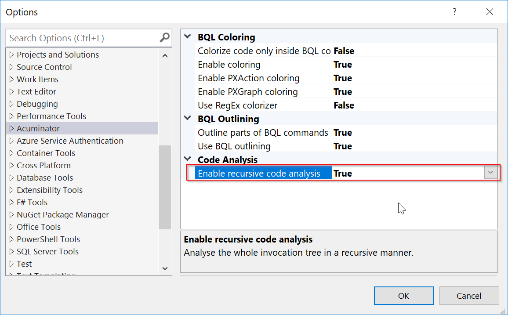

# Recursive Code Analysis
Acuminator can analyze the code recursively (that is, it can analyze the whole tree of method invocations in a recursive manner).

By default, Acuminator performs recursive code analysis. In Visual Studio, you can turn off this behavior by setting to `False` the value of **Tools > Options > Acuminator > Code Analysis > Enable recursive code analysis**. (The option is shown in the following screenshot.) 



Recursive code analysis is always turned on if the analyzers are used as a NuGet package. 

## Development of Recursive Code Analysis
For many diagnostics, Acuminator should check not only the original syntax node, but also all the code that is invoked within that node.

For example, suppose that you want to show a diagnostic if a long-running operation is started from an event handler, as shown in the following code example.

```C#
protected virtual void _(Events.RowSelected<SOOrder> e)
{
    PXLongOperation.Start(() => Release(e.Row)); // show a diagnostic here
}
```

However, a part of the logic can be moved to a separate method or class, as shown in the following example. You want to show the diagnostic in the original syntax node.

```C#
private void PerformRelease(SOOrder row)
{
    PXLongOperation.Start(() => Release(e.Row));
}

protected virtual void _(Events.RowSelected<SOOrder> e)
{
    PerformRelease(e.Row); // a diagnostic should be here
}
```

Because the analysis of the whole tree of invocations is quite complex and it is not convenient to write this analysis for every diagnostic you create, the code of Acuminator includes the special class (`NestedInvocationWalker`) that incapsulates this logic. With this class, you can reuse the logic in every new diagnostic.

## `NestedInvocationWalker` Class
`NestedInvocationWalker` is a C# syntax walker that follows any code invocations found in the original syntax node being analyzed. `NestedInvocationWalker` directly inherits from `CSharpSyntaxWalker`.

For each invocation, `NestedInvocationWalker` obtains a linked symbol, founds declaration syntax reference (if a source code for the symbol is available), and analyzes the referenced code recursively.

`NestedInvocationWalker` supports the following invocations:

 - Constructors
 - Method invocations (including expression-bodied methods)
 - Property getters and setters (both from assignment and from object initializers)
 - Local lambda functions

## The Use of the `NestedInvocationWalker` Class
If you need to use the recursive code analysis in a new diagnostic, you derive a syntax walker class from `NestedInvocationWalker`. You must use the special methods from the base `NestedInvocationWalker` class, which are listed below, instead of the `CSharpSyntaxWalker` methods.

### `SemanticModel GetSemanticModel(SyntaxTree syntaxTree)`
Obtains a `SemanticModel` for a node. `NestedInvocationWalker` walks across different syntax trees and different documents; the returned `SemanticModel` is tied to the current `SyntaxTree`. 
Use this method each time you need the `SemanticModel` for a node.

### `void ReportDiagnostic(Action<Diagnostic> reportDiagnostic, DiagnosticDescriptor diagnosticDescriptor, SyntaxNode node, params object[] messageArgs)`
Reports a diagnostic for the provided descriptor on the syntax node from which the recursive analysis has been started. This method excludes diagnostic duplication and determines the correct syntax node to report the diagnostic, as shown in the following code example.

```C#
private void PerformRelease(SOOrder row)
{
    // Invalid call is found here, but we don't want to report it
    // in this method because the object under analysis
    // is an event handler method declaration
    PXLongOperation.Start(() => Release(e.Row));
}

protected virtual void _(Events.RowSelected<SOOrder> e)
{
    PerformRelease(e.Row); // a diagnostic should be reported for this node
}
```

Use this method for each diagnostic report within the walker.

### `T GetSymbol<T>(ExpressionSyntax node) where T : class, ISymbol`
Returns a precise symbol or the most appropriate candidate and tries to cast it to the requested symbol type.

### `void ThrowIfCancellationRequested()`
Verifies a cancellation token that has been passed to the constructor. Use this method instead of the manual verifications of a cancellation token.

## Overriding of the Methods of the `Visit` Family
If you override any of the `Visit` methods, you have to do the following:

 - If the diagnostic has not been reported for the current node yet, call the `base` implementation. 
 - If the diagnostic has already been reported for the current node, don't call `base` implementation to avoid unnecessary visits.

The following code example shows a typical pattern.

```C#
public override void VisitInvocationExpression(InvocationExpressionSyntax node)
{
	ThrowIfCancellationRequested();

	var methodSymbol = GetSymbol<IMethodSymbol>(node);

	if (methodSymbol != null && ShouldReportDiagnostic(methodSymbol))
	{
		ReportDiagnostic(_context.ReportDiagnostic, Descriptors.DiagnosticDescriptor, node);
	}
	else
	{
		base.VisitInvocationExpression(node);
	}
}
```
