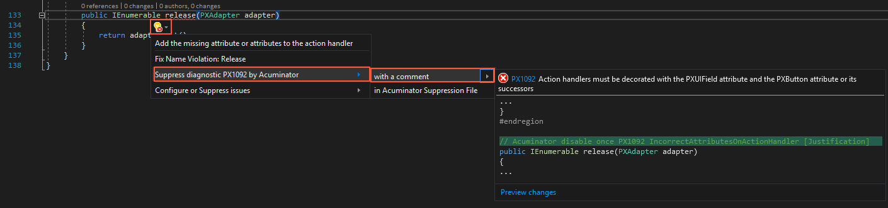
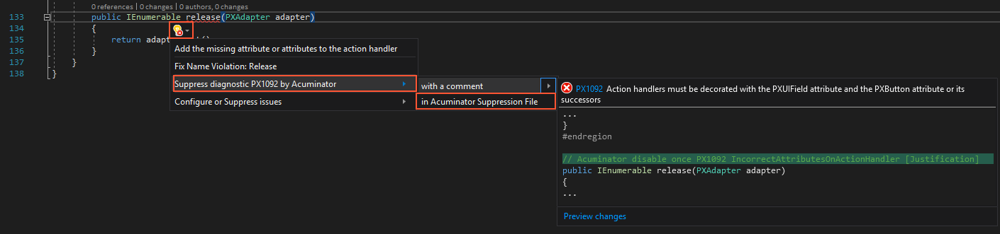

# Diagnostic Suppression
If a diagnostic is not relevant to a specific code fragment and you have an explanation of why it is not relevant, you can suppress the diagnostic so that it is not displayed for the code fragment.

You can suppress Acuminator diagnostics in one of the following ways (which are described in greater detail below):

 - By adding a specific comment directly in code. This way is available for Acuminator installed either from the VSIX package or from the NuGet package.
 - By adding a code fragment to the Acuminator suppression file. This way is available for Acuminator installed from either the VSIX package or the NuGet package. However, the way you create and maintain the suppression file depends on how Acuminator is installed, as described in the sections below.

## Diagnostic Suppression by Adding a Code Comment
You can suppress any diagnostic by adding a specific comment directly in code. To add a suppression comment, you select **Suppress the PXYYYY diagnostic with Acuminator > in a comment** (where PXYYYY is the code of the diagnostic) as a code fix for the diagnostic, as shown in the following screenshot.



The code below shows an example of a suppression comment that has been added by the code fix. A suppression comment includes the following parts:

 - The code of the diagnostic (`PX1053` in the code example below).
 - The name of the diagnostic (`ConcatenationPriorLocalization` in the following code example), which can give a code reviewer an idea of what the suppressed diagnostic is about.
 - The justification of the suppression, which explains why this diagnostic is suppressed for this code fragment. You type the explanation instead of `[Justification]`.

```C#
...
else
{
    if (!Attribute.IsDefined(method, typeof(PXSuppressEventValidationAttribute)))
        // Acuminator disable once PX1053 ConcatenationPriorLocalization [Justification]
        throw new PXException(string.Format(MsgNotLocalizable.InvalidArgumentTypeInEventHandler, 
            method.DeclaringType.FullName, method.Name));
    else
        return null;
}
...
```

If Acuminator displays multiple diagnostics for one line, you can add multiple suppression comments for this line (one comment under another).

To stop the suppression of a diagnostic in the code fragment, you remove the comment that corresponds to the diagnostic from the code.

## Diagnostic Suppression in the Acuminator Suppression File
You can suppress a particular diagnostic in a specific place in your project in the Acuminator suppression file. The suppression file is an XML file that has the `acuminator` extension and the name that matches the assembly name of the project (which is the same as the project name unless the assembly name has been overridden in the project settings). The suppression file stores the list of the diagnostics that are suppressed in the project.

The Acuminator suppression mechanism differs from the standard suppression mechanism of Visual Studio. With the Acuminator suppression mechanism, you can suppress a particular diagnostic in a specific place in the project, while the standard mechanism suppresses all diagnostics with this ID in the type or its member.

The way you create and maintain the suppression file depends on how Acuminator is installed, as described in the following sections.

### Suppression File with the VSIX Package
When Acuminator is installed from the VSIX package, you can suppress a diagnostic in the suppression file directly from Visual Studio. To suppress a diagnostic in the Acuminator suppression file, you select **Suppress the PXYYYY diagnostic with Acuminator > in the Acuminator suppression file** (where PXYYYY is the code of the diagnostic) as a code fix for the diagnostic, as shown in the following screenshot.



The suppressed diagnostic is saved in the Acuminator suppression file, which is located in the folder of your Visual Studio project. If there is no Acuminator suppression file in the project folder, the file is created automatically.

To stop the suppression of the diagnostic in the particular place in the code, you remove the diagnostic from the Acuminator suppression file manually.

### Suppression File with the NuGet Package
When Acuminator is installed from the NuGet package, the code fix that adds records to the suppression file is not available, and the suppression file is not created automatically. You create and maintain the suppression file manually and pass it to Acuminator as an additional file. To set up the suppression file for a project, you do the following:

1. In the root folder of the project, create a suppression file that has the `acuminator` extension and the name that matches the assembly name of the project (such as `MyProject.acuminator`). The suppression file must contain at least the root `suppressions` element, as the following code shows.

    ```XML
    <?xml version="1.0" encoding="utf-8"?>
    <suppressions>
    </suppressions>
    ```

2. In the project file, add the suppression file to the `AdditionalFiles` item group, as the following code shows.

    ```XML
    <ItemGroup>
      <AdditionalFiles Include="MyProject.acuminator" />
    </ItemGroup>
    ```

To suppress a diagnostic, you add a `suppressMessage` record to the suppression file. Because a record references the internal structure of the analyzed code, we recommend that you generate the records instead of writing them by hand in one of the following ways:

 - By using the VSIX package, which adds the records through the **in the Acuminator suppression file** code fix. You can then reuse the generated suppression file in the projects that use the NuGet package.
 - By running the Acuminator Console Runner in the suppression file generation mode. For details, see [Acuminator CLI](../AcuminatorCLI.md).

To stop the suppression of a diagnostic, you remove the corresponding record from the suppression file.

> **Note:** The suppression file is matched to the project by the assembly name. If the name of the suppression file does not match the assembly name of the project, the suppression file is ignored.