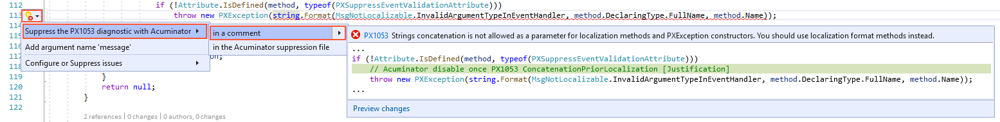
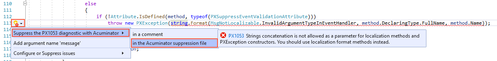

# Diagnostic Suppression
If a diagnostic is not relevant to a specific code fragment and you have an explanation of why it is not relevant, you can suppress the diagnostic so that it is not displayed for the code fragment.

You can suppress Acuminator diagnostics in one of the following ways (which are described in greater detail below):

 - By adding a specific comment directly in code
 - By adding a code fragment to the Acuminator suppression file

## Diagnostic Suppression by Adding a Code Comment
You can suppress any diagnostic by adding a specific comment directly in code. To add a suppression comment, you select **Suppress the PX10YY diagnostic with Acuminator > in a comment** (where PX00YY is the code of the diagnostic) as a code fix for the diagnostic, as shown in the following screenshot.



The code below shows an example of a suppression comment that has been added by the code fix. A suppression comment includes the following parts:

 - The code of the diagnostic (`PX1007` in the code example below).
 - The name of the diagnostic (`NoXmlCommentForPublicClass` in the following code example), which can give a code reviewer an idea of what the suppressed diagnostic is about.
 - The justification of the suppression, which explains why this diagnostic is suppressed for this code fragment. You type the explanation instead of `[Justification]`.

```C#
// Acuminator disable once PX1007 NoXmlCommentForPublicClass [Justification]
public class ARReleaseProcess_Extension : PXGraphExtension<ARReleaseProcess>
{
    ...
}
```

To stop the suppression of the diagnostic in the code fragment, you remove the comment from the code.

## Diagnostic Suppression in the Acuminator Suppression File
You can suppress a particular diagnostic in a specific place in your project. To suppress a diagnostic in the Acuminator suppression file, you select **Suppress the PX10YY diagnostic with Acuminator > in the Acuminator suppression file** (where PX00YY is the code of the diagnostic) as a code fix for the diagnostic, as shown in the following screenshot.



The suppressed diagnostic is saved in the Acuminator suppression file, which is located in the folder of your Visual Studio project. This file has the same name as the project file and the `acuminator` extension. If there is no Acuminator suppression file in the project folder, the file is created automatically.

The Acuminator suppression mechanism differs from the standard suppression mechanism of Visual Studio. With the Acuminator suppression mechanism, you can suppress a particular diagnostic in a specific place in the project, while the standard mechanism suppresses all diagnostics with this ID in the type or its member.

To stop the suppression of the diagnostic in the particular place in the code, you remove the diagnostic from the Acuminator suppression file manually.