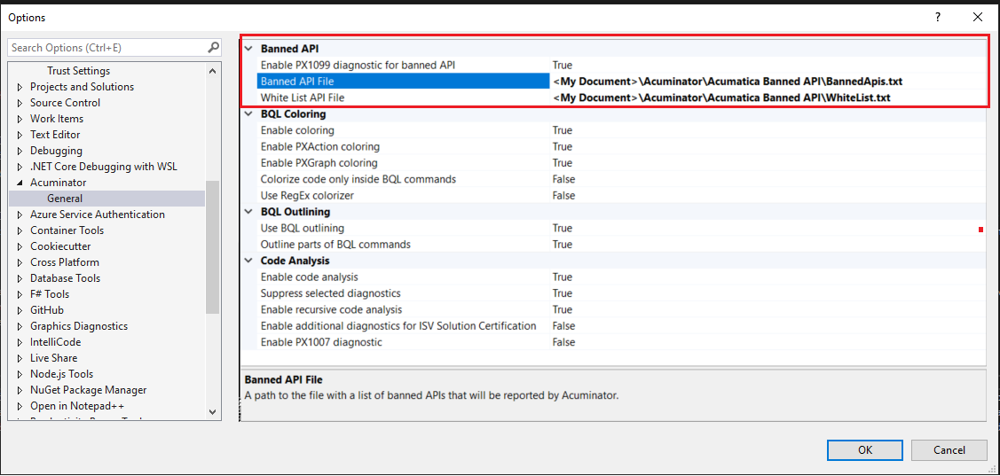

# PX1099
This document describes the PX1099 diagnostic.

## Summary

| Code   | Short Description                                                                | Type    | Code Fix    | 
| ------ | ---------------------------------------------------------------------------------| ------- | ----------- | 
| PX1099 | The API reported by the diagnostic should not be used with Acumatica Framework.  | Warning | Unavailable | 

## Diagnostic Description

The PX1099 diagnostic detects APIs that should not be used with Acumatica Framework. For each banned API, there may be its own reason to being banned. The next section provides an example of such banned API with the `Math.Round` overloads that do not specify a method for rounding a midpoint.

### Banned Math.Round Overloads

By default, the `System.Math.Round` method uses [Banker's rounding](https://wiki.c2.com/?BankersRounding) that rounds midpoint to the nearest even number.
This means that `12.5` will be rounded to `12` and `13.5` to `14`. This behavior is not compatible with Microsoft Excel rounding that by default uses midpoint rounding away from zero.
Such behavior also surprises many developers who expected the rounding to be done with an away from zero method which is more known.

On the other hand, Banker's rounding to even has its own advantages. The away from zero rounding on average has a bigger rounding error than Banker's rounding because more numbers are rounded up than down. 
The rounding error from multiple operations with the away from zero rounding will be bigger on average.

It is not forbidden to use either type of rounding, but it is important to understand which one is used in the code and to be consistent and explicit with it. Thus the PX1099 diagnostic forbids the `Math.Round` method overloads that do not specify a method for rounding a midpoint.

#### Example of Incorrect Code

In the following example, the forbidden overload of the `System.Math.Round` is used. 
```C#
public class MyGraph : PXGraph<MyGraph>
{
	public virtual decimal CalculateCuryAmount(decimal amount, decimal curyRate, int precision)
	{
		// The rounding used by default will be Banker's Rounding that rounds the midpoint to the nearest even number. This behavior can be unexepected for developers who are used to rounding away from zero.
		return Math.Round(amount * curyRate, precision);   
	}
}
```

#### Example of Correct Code

This example shows how to specify the `Math.Round` method with the `MidpointRounding.AwayFromZero` parameter to round midpoint away from zero.
```C#
public class MyGraph : PXGraph<MyGraph>
{
	public virtual decimal CalculateCuryAmount(decimal amount, decimal curyRate, int precision)
	{
		return Math.Round(amount * curyRate, precision, MidpointRounding.AwayFromZero);   
	}
}
```

## Analysis Overview

The main idea of the PX1099 analysis is that all API usages in the checked code are checked against a list of forbidden APIs. The API is reported if one of the following criteria is met:

- The API itself is in the list of banned APIs.
- A namespace contains the API that is in the list of banned APIs.
- One of the types contains the API that is is in the list of banned APIs.
- API is a type and one of its base types is in the list of banned APIs.
- API is a method, property or event, it is an override of a base type member, and one of the overridden members is in the list of banned APIs.

The diagnostic also supports the white list of APIs that are not reported even if they are recognized as forbidden. For example, the analysis reports the `System.Environment` type and all its members as forbidden. 
However, the `System.Environment.NewLine` property is whitelisted and is not reported by the PX1099 diagnostic. The white list allows to avoid frequently reported false positives and configure analysis more granularly.

## Diagnostic Settings

The PX1099 diagnostic provides advanced configuration options to allow you to customize the diagnostic behavior. You can disable the PX1099 diagnostic or configure custom files with banned and whitelisted APIs.
You can find the PX1099 settings in the following Acuminator section of Visual Studio settings: `Tools -> Options -> Acuminator -> Banned API`.


The following settings are available:

- `Enable PX1099 diagnostic for banned API`: Enables or disables the PX1099 diagnostic. By default, the diagnostic is enabled.
- `Banned API File`: Specifies the path to the file with banned APIs.
- `White List API File`: Specifies the path to the file with whitelisted APIs.

### Banned and Whitelisted APIs

Acuminator comes with default lists of banned and whitelisted APIs. These files are deployed by Acuminator on your machine in the `<My Documents Folder>\Acuminator\Acumatica Banned API` folder. 
The `Banned API File` and `White List API File` settings are initially set to these files. You can modify these files to customize the list of banned and whitelisted APIs.

Note, that clearing the `Banned API File` and `White List API File` settings in Visual Studio will not prevent the PX1099 diagnostic from running. The diagnostic will use the default lists of banned and whitelisted APIs that are 
embedded in the Acuminator assemblies. To disable the PX1099 diagnostic, you need to set the `Enable PX1099 diagnostic for banned API` setting to `false`.

#### Default Banned APIs

The following table shows the default banned APIs that are included in the Acuminator.

|                           API Name                 | API Type  | API Ban Type |                           Ban Reason                                  |
| -------------------------------------------------- | --------- |--------------| --------------------------------------------------------------------- |
| `System.Math.Round(System.Double)`                 |   Method  |    General   | Math.Round uses Banker's Rounding by default, which rounds to the closest even number. Usually, this is not the desired rounding behavior. Use the Math.Round overload with the MidpointRounding parameter to explicitly specify the desired rounding behavior. |
| `System.Math.Round(System.Decimal)`                |   Method  |    General   | Math.Round uses Banker's Rounding by default, which rounds to the closest even number. Usually, this is not the desired rounding behavior. Use the Math.Round overload with the MidpointRounding parameter to explicitly specify the desired rounding behavior. |
| `System.Math.Round(System.Double, System.Int32)`   |   Method  |    General   | Math.Round uses Banker's Rounding by default, which rounds to the closest even number. Usually, this is not the desired rounding behavior. Use the Math.Round overload with the MidpointRounding parameter to explicitly specify the desired rounding behavior. |
| `System.Math.Round(System.Decimal, System.Int32)`  |   Method  |    General   | Math.Round uses Banker's Rounding by default, which rounds to the closest even number. Usually, this is not the desired rounding behavior. Use the Math.Round overload with the MidpointRounding parameter to explicitly specify the desired rounding behavior. |
| `System.Data.Entity`                               | Namespace |      ISV     | Usage of this namespace is forbidden in Acumatica customizations.             |
| `System.Data.SqlClient`                            | Namespace |      ISV     | Usage of this namespace is forbidden in Acumatica customizations.             |
| `System.AppDomain`                                 |   Type    |      ISV     | Usage of the AppDomain type is forbidden in Acumatica customizations.             |
| `System.Diagnostics.ProcessStartInfo`              |   Type    |      ISV     | Usage of the ProcessStartInfo type is forbidden in Acumatica customizations.      |
| `System.Environment`                               |   Type    |      ISV     | Usage of the Environment type is forbidden in Acumatica customizations.           |
| `System.IO.File`                                   |   Type    |      ISV     | Usage of the File type is forbidden in Acumatica customizations.                  |
| `System.GC`                                        |   Type    |      ISV     | Access to garbage collector is forbidden in Acumatica customizations. |
| `System.OperatingSystem`                           |   Type    |      ISV     | Usage of the OperatingSystem type is forbidden in Acumatica customizations.       |
| `System.Reflection.MethodInfo`                     |   Type    |      ISV     | Usage of reflection is forbidden in Acumatica customizations.            |
| `PX.Common.WebConfig`                              |   Type    |      ISV     | Access to the WebConfig type is forbidden in Acumatica customizations.    |

You can also find the latest version of this list in the Acuminator GitHub repository:
https://github.com/Acumatica/Acuminator/blob/dev/src/Acuminator/Acuminator.Utilities/BannedApi/Data/BannedApis.txt

#### Default Whitelisted APIs

The following table shows the default whitelisted APIs that are included in the Acuminator.

|             API Name          | API Type  | API Ban Type |
| ----------------------------- | --------- | ------------ |
| `System.Environment.NewLine`  | Property  |   General    |

You can also find the latest version of the white list in the Acuminator GitHub repository:
https://github.com/Acumatica/Acuminator/blob/dev/src/Acuminator/Acuminator.Utilities/BannedApi/Data/WhiteList.txt
 
### API Format

The records in the file with banned APIs have the same API format. Each API record is represented by a single line in the file and consists of the following three parts separated by a whitespace:

1. Mandatory API identifier.
2. Mandatory API ban type that indicates for whom API is banned. There are two available values:
	- `General` indicates that the API is banned for all developers.
	- `ISV` indicates that the API is banned for ISV developers only.
3. Optional API ban reason. This is a string that explains why the API is banned.

The API identifier is based on the `DocID` format: https://learn.microsoft.com/en-us/dotnet/csharp/language-reference/xmldoc/#id-strings. 
This format is chosen due to its convenience. It is widely used by .Net technology, and Roslyn already has a built-in functionality to generate `DocID` for APIs.
However, the `DocID` format has been enhanced to store more information about the API as follows:

- In the full API name, the namespace part is separated from the containing type names with a special hyphen `-` separator. This allows Acuminator to deduce which part of the API name is the namespace. This is impossible in the standard `DocID` format.
  An example of an API name with a namespace is shown in the following string.
  ```cs 
  T:System-Environment
  ```
- If the full API name includes nested types, then their names are separated by `+` to simplify the parsing of the API name into parts, as shown in the following example.
  ```cs
  T:Microsoft.AspNet.Mvc.ModelBinding-ModelStateDictionary+PrefixEnumerable
  ```

The file with whitelisted APIs has the same format as the file with banned APIs. However, the "API Ban Type" part while being mandatory is ignored by Acuminator. We recommend to always set it to `General`.
The API ban reason in the whitelist file is not used by Acuminator and should be omitted.

## Related Articles

- [Default Banned API List](https://github.com/Acumatica/Acuminator/blob/feature/ATR-819-dev-check-forbidden-APIs/src/Acuminator/Acuminator.Utilities/BannedApi/Data/BannedApis.txt)
- [Default Whitelisted API List](https://github.com/Acumatica/Acuminator/blob/feature/ATR-819-dev-check-forbidden-APIs/src/Acuminator/Acuminator.Utilities/BannedApi/Data/WhiteList.txt)
- Banker's rounding
  - [Source 1](https://docs.alipayplus.com/alipayplus/alipayplus/reconcile_mpp/bank_rounding?role=MPP&product=Payment1&version=1.5.4)
  - [Source 2](https://wiki.c2.com/?BankersRounding)